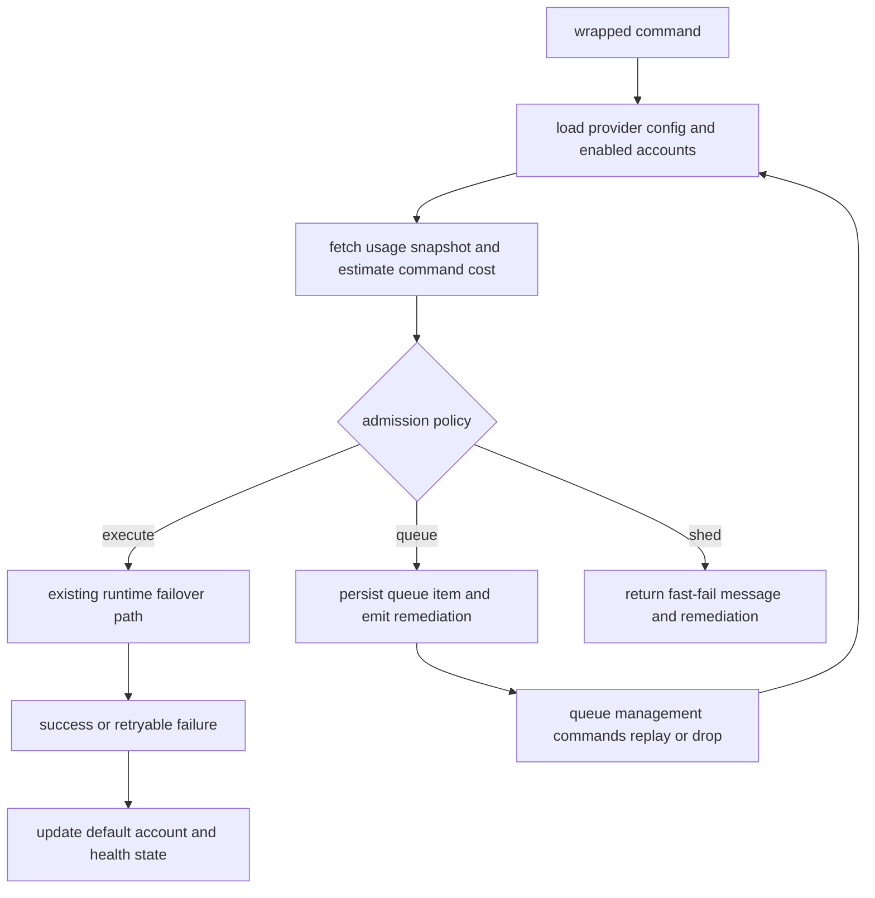
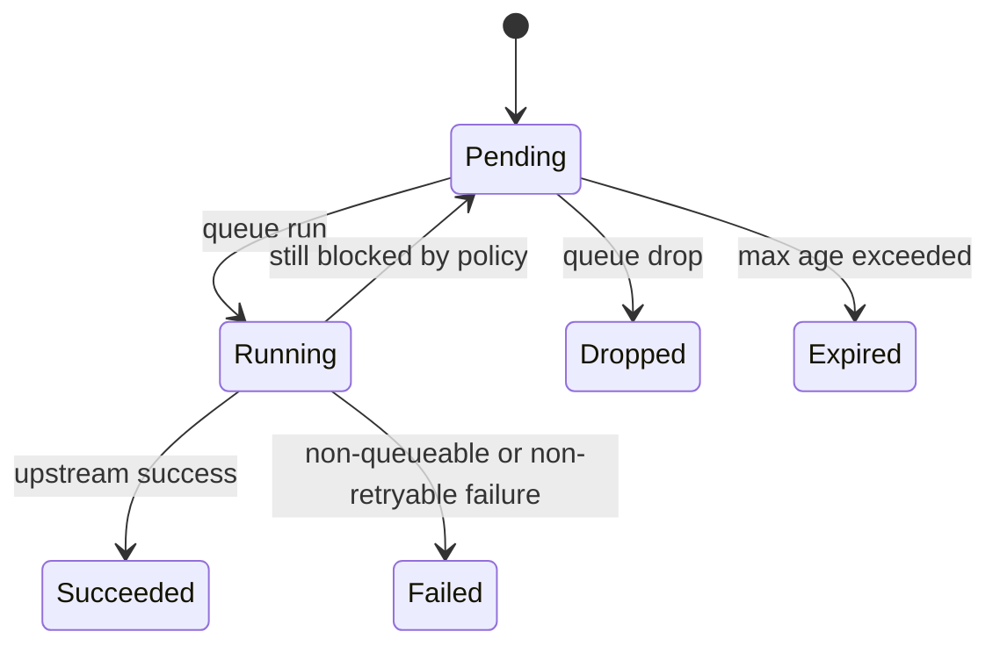

# Quota-Aware Admission Control and Backpressure - Plan

## Goal Capsule

- **Objective:** Extend `clifwrap` from post-failure failover into pre-request quota-aware admission control that can execute, queue, or shed work before the upstream CLI spends quota or returns a retryable failure.
- **Why now:** The wrapper already knows how to rotate accounts, monitor low fallback pools, and read provider usage. The missing piece is acting on that information before requests are sent.
- **Authority:** This plan is the implementation authority for quota-aware scheduling and backpressure in this repo. Existing low-fallback monitoring stays in place unless a unit below explicitly expands it.
- **Assumption:** Because the user did not answer the default low-capacity policy question, the initial implementation will be policy-driven with a conservative global default and provider or command overrides rather than one hardwired behavior.
- **Stop conditions:** The wrapper can preflight capacity, make a documented admission decision, persist queued work when allowed, expose queue and remediation state through wrapper-owned commands, and preserve current pass-through and failover behavior for providers that do not opt into the new control plane.

---

## Product Contract

### Summary

`clifwrap` should stop waiting for provider CLIs to fail on exhausted quota before reacting. Instead, it should estimate whether a wrapped command can run against the current account pool, decide whether to execute, queue, or reject it based on policy, and tell the operator what to do next through approved provisioning paths.

### Problem Frame

The current wrapper reacts only after an upstream command fails or after status checks reveal a low fallback pool. That leaves three gaps:

- Quota can be consumed on requests the wrapper could have predicted would fail.
- There is no durable, generic way to defer allowed work until capacity returns.
- Remediation is mostly operational knowledge in the user's head rather than a first-class wrapper surface.

This work is cross-cutting because it changes provider config, state persistence, runtime request flow, wrapper-only commands, and health reporting.

### Requirements

- R1. The wrapper must support provider-level pre-request admission control before the upstream CLI is executed.
- R2. Admission behavior must stay generic in the core wrapper and be driven by declarative provider metadata plus user config and env overrides, not provider-name branches in runtime logic.
- R3. Admission control must support at least three outcomes: execute now, queue for later execution, or fail fast with a clear user-facing reason.
- R4. Capacity evaluation must use existing provider usage lookups when available, combine them with configurable cost estimation, and behave conservatively when usage is stale, unavailable, or unknown.
- R5. Queued work must be durable across process exits, idempotently replayable, and manageable through wrapper-owned CLI commands.
- R6. Status and health surfaces must expose low-capacity state, queued backlog, and team-approved remediation paths without automating identity or account creation.
- R7. Existing failover, low-fallback alerts, interactive pass-through behavior, install idempotency, and non-configured-provider passthrough must continue to work.
- R8. Firecrawl and Tavily must both be expressible through the same control plane, even if their cost estimation rules differ.

### Success Criteria

- Wrapped commands can be blocked or deferred before upstream execution when projected capacity is insufficient.
- Queueable work can be listed, replayed, and dropped without editing state files by hand.
- Health output explains whether a provider is unhealthy because of low fallback pool, low capacity, expired queued work, or failed recovery hooks.
- Provider-specific rollout only requires metadata or config changes for policy and estimation, not new hardcoded runtime branches.

### Scope Boundaries

#### In Scope

- Preflight capacity checks based on provider usage and estimated command cost.
- Declarative policy for execute, queue, and shed behavior.
- Durable wrapper-managed queue state and queue-management commands.
- Status and remediation output tied to approved provisioning instructions.
- Firecrawl and Tavily metadata updates plus generic tests.

#### Deferred to Follow-Up Work

- Automatic background daemons or long-lived workers that continuously drain queues without an explicit wrapper command or external scheduler.
- Fine-grained provider billing parity for every possible subcommand if an initial conservative estimator is enough to ship a safe control plane.
- Automatic provider provisioning, account creation, or any identity-generation workflow.

#### Out of Scope

- Replacing the existing failover engine.
- Rewriting provider auth-management flows.
- Building a hosted control plane or remote queue service.

### Assumptions and Dependencies

- Provider usage endpoints remain the source of truth for remaining capacity.
- Existing wrapper state under `~/.local/state/clifwrap/` remains the correct persistence root for new queue and capacity data.
- Users who need automatic draining can invoke a wrapper command from cron, systemd timers, or another approved scheduler rather than relying on an in-process daemon.

---

## Planning Contract

### Key Technical Decisions

- KTD1. Introduce a dedicated scheduling boundary instead of embedding more policy code directly into `src/clifwrap/runtime.py`.
  Rationale: `runtime.py` already owns failover, status, and managed-auth behavior. Admission control and queue handling add enough state and branching to justify a separate module while still keeping the runtime entrypoint thin.

- KTD2. Model quota-aware control as declarative policy plus provider estimates, not as exact billing simulation.
  Rationale: Firecrawl and Tavily expose usage, but their real billing behavior can vary by command shape. A conservative estimate plus an unknown-capacity policy is safer and more maintainable than pretending the wrapper can perfectly mirror provider billing.

- KTD3. Make queue draining explicit and wrapper-owned through CLI commands instead of introducing a daemon.
  Rationale: This keeps the first release idempotent, testable, and low-carrying-cost while still enabling users to automate drains with existing schedulers.

- KTD4. Keep remediation human-approved and declarative.
  Rationale: The wrapper can surface provisioning docs, commands, and messages, but it should not automate identity or account creation when capacity is low.

- KTD5. Preserve existing low-fallback monitoring and layer capacity health alongside it.
  Rationale: Low fallback count and low usable quota are related but distinct failure modes. Operators need both signals rather than a merged opaque health state.

### High-Level Technical Design

### Plan-Specific Shape

- Admission control will be inserted before `_run_attempts()` invokes the upstream command.
- Capacity policy will be provider-configurable, with optional per-command overrides and a distinct unknown-capacity rule.
- Queue persistence and replay will use wrapper state files plus wrapper-only CLI subcommands rather than upstream provider commands.

### Open Questions

- Deferred. Whether the initial global default should prefer `queue` or `shed` for commands without an explicit override. The implementation should make this configurable and documented rather than blocking the feature on one default.
- Deferred. Whether queue backlog should affect `clifwrap status --check` immediately or only when age and count thresholds are exceeded.

### System-Wide Impact

- **CLI UX:** Wrapped commands gain new fast-fail and deferred-execution paths, so messaging must distinguish capacity policy from retryable upstream failure.
- **State lifecycle:** The wrapper will persist queue items, capacity snapshots, and possibly replay metadata in addition to default-account and alert state.
- **Operations:** Teams gain a supported place to declare provisioning guidance instead of relying on ad hoc knowledge.
- **Provider parity:** Firecrawl and Tavily stay first-class examples, but the implementation must remain extensible for additional providers with different usage semantics.

### Risks and Mitigations

- **Risk:** Incorrect estimates may over-block useful work.
  **Mitigation:** Provide explicit unknown-capacity and per-command override policy, start with conservative provider metadata, and test both allow and block paths.

- **Risk:** Queue replay can duplicate user intent or drift from the original environment.
  **Mitigation:** Persist argv, selected provider, rendered admission metadata, timestamps, and replay count; validate queue items before replay; expose drop and inspect commands.

- **Risk:** Runtime complexity regresses current failover behavior.
  **Mitigation:** Keep admission logic in a new module, call into the existing attempt engine only after admission passes, and extend current wrapper tests rather than replacing them.

- **Risk:** Remediation surfaces become provider-specific hardcoding in core paths.
  **Mitigation:** Put provisioning hints, commands, and docs in config and provider metadata, then render them through generic helpers.

### Sources and Research

- Tavily docs confirm Bearer-token auth and a documented `GET /usage` endpoint suitable for preflight capacity checks.
- Firecrawl CLI docs confirm API-key-driven auth and CLI-visible credit usage, aligning with the existing wrapper usage endpoint configuration.
- Existing repo patterns already cover state persistence, env-driven provider overrides, failover messaging, and health reporting in `src/clifwrap/runtime.py`, `src/clifwrap/state.py`, and `tests/test_wrapper.py`.

---

## Implementation Units

### U1. Add Declarative Capacity-Control Config

- **Goal:** Introduce a generic config model for admission policy, cost estimation, queue behavior, and remediation surfaces.
- **Requirements:** R1, R2, R3, R4, R6, R8
- **Dependencies:** None
- **Files:** `src/clifwrap/config.py`, `src/clifwrap/providers.toml`, `src/clifwrap/__main__.py`, `README.md`, `tests/test_wrapper.py`
- **Approach:** Add a provider-level capacity-control section that can be created from catalog defaults, user config, and env overrides. The shape should cover default action, unknown-capacity action, reserve threshold, queue retention, provisioning hints, and per-command estimated cost overrides.
- **Patterns to follow:** Follow the existing `fallback_monitor`, `auth_management`, and `usage` config layering pattern in `src/clifwrap/config.py`.
- **Test scenarios:**
  - Happy path: loading a provider with a capacity-control block yields the expected parsed defaults and provider override values.
  - Happy path: env overrides replace configured capacity policy fields without disturbing unrelated provider config.
  - Edge case: a provider with no capacity-control block stays backward-compatible and behaves like pure passthrough to the existing runtime path.
  - Error path: invalid action names, negative thresholds, or malformed command-cost entries fail config loading with targeted validation errors.
  - Integration: built-in `tvly` and `firecrawl` catalog entries resolve into capacity-control config without hardcoded special branches in runtime.
- **Verification:** A reader can inspect one provider config path and see that policy, estimation, and remediation are all declared without adding provider-name branches to the config layer.

### U2. Build the Admission and Capacity Engine

- **Goal:** Add a reusable preflight engine that converts usage snapshots and command estimates into execute, queue, or shed decisions.
- **Requirements:** R1, R2, R3, R4, R7, R8
- **Dependencies:** U1
- **Files:** `src/clifwrap/runtime.py`, `src/clifwrap/state.py`, `src/clifwrap/scheduling.py`, `tests/test_wrapper.py`
- **Approach:** Introduce a new scheduling module responsible for reading usage snapshots, estimating command cost, ranking candidate accounts, and returning an admission decision object that runtime can act on. Persist enough state to avoid needless repeated usage calls and to record why a command was blocked or deferred.
- **Execution note:** Start with unit-style tests around the decision engine before threading it into `run_app()`.
- **Patterns to follow:** Mirror the existing `_usage_status()` and `_status_snapshot()` helper style, but keep new policy evaluation out of `runtime.py` where possible.
- **Test scenarios:**
  - Happy path: when remaining capacity comfortably exceeds the estimated cost plus reserve, the engine returns `execute` for the active or best candidate account.
  - Happy path: when the active account is low but another enabled account has capacity, the engine chooses execution on the alternate account rather than queuing.
  - Edge case: when usage is unavailable and provider policy says `allow`, the engine permits execution and records an unknown-capacity reason.
  - Edge case: when usage is unavailable and provider policy says `queue` or `shed`, the engine returns the configured non-execute outcome without calling upstream.
  - Error path: malformed or stale usage snapshot data is treated as unknown capacity rather than causing a traceback.
  - Integration: admission decisions preserve current account ordering and default-account semantics expected by failover once execution begins.
- **Verification:** The engine can be exercised entirely in tests with mocked usage payloads and produces stable decision objects that runtime can consume without inspecting provider names.

### U3. Add Durable Queue Persistence and Queue Commands

- **Goal:** Make deferred work durable and operator-manageable through wrapper-owned commands.
- **Requirements:** R3, R5, R6, R7
- **Dependencies:** U1, U2
- **Files:** `src/clifwrap/state.py`, `src/clifwrap/scheduling.py`, `src/clifwrap/__main__.py`, `README.md`, `tests/test_wrapper.py`
- **Approach:** Persist queue items under wrapper state with enough metadata to replay safely: provider, argv, enqueue time, decision reason, replay count, and queue policy snapshot. Add wrapper commands such as `clifwrap queue list`, `clifwrap queue run`, and `clifwrap queue drop`, with JSON output where it materially helps automation.
- **Patterns to follow:** Follow the existing wrapper-owned `account` and `status` subcommand model in `src/clifwrap/__main__.py` and state-file JSON persistence in `src/clifwrap/state.py`.
- **Test scenarios:**
  - Happy path: a queueable low-capacity command is persisted and `clifwrap queue list` shows provider, age, and reason.
  - Happy path: `clifwrap queue run` replays an item once capacity becomes available and removes it on success.
  - Edge case: replaying a queued item that is still blocked by policy leaves it pending and increments replay metadata without duplicating entries.
  - Edge case: expired queue items are reported distinctly and can be dropped without manual file edits.
  - Error path: malformed queue state is surfaced as a wrapper error instead of silently deleting data.
  - Integration: queue commands work without an installed shim because they are wrapper-owned `clifwrap` commands, not provider pass-throughs.
- **Verification:** An operator can inspect, replay, and drop queued work using wrapper commands alone, and queued items survive process restarts.

### U4. Integrate Admission Decisions into Wrapped Runtime and Health Surfaces

- **Goal:** Thread the new admission engine through the wrapped runtime, status output, and health checks without regressing existing failover and low-fallback behavior.
- **Requirements:** R1, R3, R6, R7
- **Dependencies:** U2, U3
- **Files:** `src/clifwrap/runtime.py`, `src/clifwrap/__main__.py`, `src/clifwrap/providers.toml`, `README.md`, `tests/test_wrapper.py`
- **Approach:** Run admission checks after managed-auth handling but before passthrough upstream execution. Extend status snapshots with capacity-policy, queue backlog, and remediation fields. Decide how `status --check` reports low-capacity and queued-work health without conflating those states with low fallback count.
- **Patterns to follow:** Preserve the current `run_app()` control flow ordering, `_snapshot_unhealthy()` health signal pattern, and human-plus-JSON dual output in status rendering.
- **Test scenarios:**
  - Happy path: a provider with healthy capacity still reaches the existing `_run_attempts()` path unchanged.
  - Happy path: a shed decision returns a stable nonzero exit code and a user-facing remediation message without invoking the upstream binary.
  - Edge case: passthrough commands such as `firecrawl login` still bypass admission logic when they are true upstream auth flows.
  - Edge case: low-fallback alerts and low-capacity alerts can both surface for the same provider without duplicating or corrupting messages.
  - Error path: if queue persistence fails during a `queue` decision, the wrapper returns a clear error instead of pretending the work was safely deferred.
  - Integration: `clifwrap status --json --check` reflects queue backlog and capacity health in a machine-readable way while preserving current low-fallback semantics.
- **Verification:** Running the wrapper on configured providers yields a clear, test-backed separation between execute, queue, shed, and existing retry-after-failure paths.

### U5. Ship Provider Defaults, Remediation Surfaces, and Regression Coverage

- **Goal:** Deliver the first provider rollouts, documentation, and regression tests needed to make the control plane usable and trustworthy.
- **Requirements:** R2, R4, R6, R7, R8
- **Dependencies:** U1, U2, U3, U4
- **Files:** `src/clifwrap/providers.toml`, `README.md`, `tests/test_wrapper.py`
- **Approach:** Add conservative Firecrawl and Tavily default policies, documented command-cost assumptions, and provider-specific remediation fields that point to approved operator actions. Expand tests to cover backward compatibility, provider metadata loading, and user-visible docs/examples.
- **Patterns to follow:** Keep provider behavior in `src/clifwrap/providers.toml` and document user-facing flows in `README.md`, matching the existing wrapper philosophy.
- **Test scenarios:**
  - Happy path: Firecrawl and Tavily built-in metadata load with queue or shed policies and no direct runtime provider-name branching.
  - Edge case: removing the built-in provider metadata leaves user-defined providers still able to opt into the feature through config alone.
  - Error path: documented remediation commands or URLs missing from provider config degrade to a generic message rather than crashing output.
  - Integration: existing install-idempotency, low-fallback monitor, usage-timeout, and status tests continue to pass alongside the new scheduling cases.
  - Integration: README examples for queueing, shedding, and remediation match the shipped config shape and wrapper commands.
- **Verification:** The repo ships one coherent user story for Firecrawl and Tavily plus generic extension points for future providers, with regression tests proving current behavior still holds.

---

## Verification Contract

| Gate | Scope | Expectation |
|---|---|---|
| `pytest tests/test_wrapper.py` | Full feature | Covers config parsing, admission decisions, queue lifecycle, runtime integration, status health, and backward compatibility. |
| Focused wrapper tests | During implementation | New tests should isolate config, admission, queue, and status behavior so failures point to one extension seam at a time. |
| Manual smoke via `clifwrap status` and wrapper-owned queue commands | Final proof | Confirms the shipped CLI surface matches the documented user flow without relying on direct state-file edits. |
| Legacy behavior regression | Final proof | Existing failover, low-fallback, auth-management, passthrough login, and install idempotency flows still pass unchanged. |

---

## Definition of Done

- The repo contains a generic capacity-control model, a reusable admission engine, durable queue state, and queue-management CLI commands.
- Firecrawl and Tavily can both use the new control plane without core runtime branches that special-case provider labels.
- Status output and `--check` surface low-capacity and queued-work health alongside existing low-fallback and recovery-hook signals.
- Tests cover healthy execution, alternate-account execution, queue, shed, unknown capacity, replay, expiry, and backward-compatibility cases.
- README documentation explains how to configure policy, inspect backlog, replay queued work, and surface approved provisioning guidance.
- Any abandoned scheduling experiments or duplicate policy paths introduced during implementation are removed before the work is considered complete.
